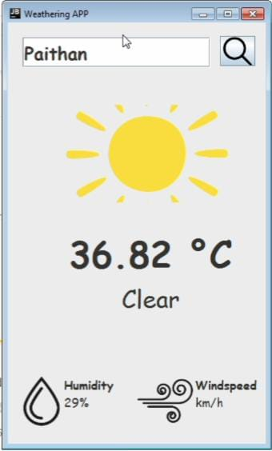

# Weather Application

This is a desktop-based **Java Swing** application that fetches real-time weather data from the **OpenWeatherMap API** and displays it in a graphical interface. The user can input a city name to retrieve the current weather conditions, temperature, humidity, and wind speed.

## Features

- **City-Based Weather Search**: Input any city name to get current weather information.
- **Real-Time Data**: Fetches live data from OpenWeatherMap.
- **Weather Icons**: Displays appropriate icons for weather conditions like clouds, rain, snow, etc.
- **Responsive UI**: User-friendly interface built with Java Swing.
- **Error Handling**: Displays error messages for invalid inputs or network issues.

## Technologies Used

- **Java Swing**: For building the graphical user interface (GUI).
- **OpenWeatherMap API**: To fetch real-time weather data.
- **JSON Parsing**: For processing the API response.
- **Maven**: Project management and dependency management.

## Screenshots

Here is a screenshot of the Weather Application:



## How to Run

1. **Clone the repository**:
   ```bash
   git clone https://github.com/your-username/weather-application.git

 
